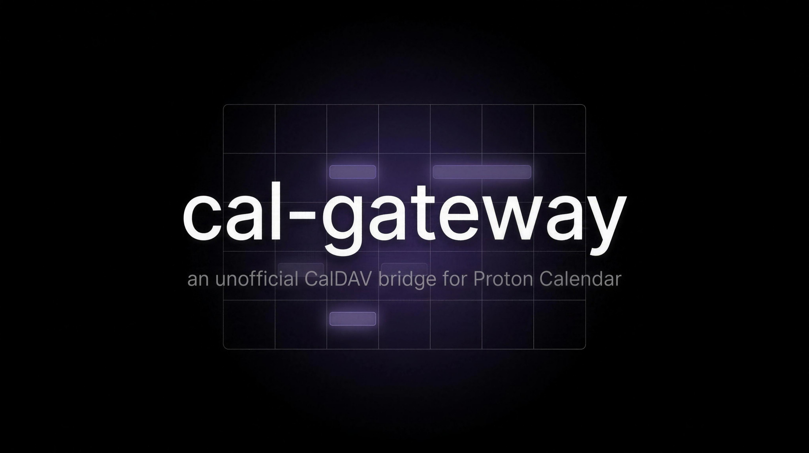

# cal-gateway



An unofficial CalDAV bridge for Proton Calendar. `cal-gateway` is a small Go
daemon that exposes your Proton Calendar to any CalDAV client (Apple Calendar,
Thunderbird, iOS/macOS, …) by decrypting Proton events locally and, on the way
back, re-encrypting writes into Proton's four-card model.

<!-- badges: placeholders until CI/release are wired up -->


---

## Why this exists

I'll be honest up front: this project cuts against Proton's whole philosophy,
and I know it. Proton is built around end-to-end encryption and its own official
clients — a self-hosted bridge that holds a decrypted session and re-serves your
calendar over CalDAV to third-party apps is, by design, at odds with that model.
I'm not hiding that behind a clever framing; it's a deliberate, eyes-open
trade-off.

So why build it? For a concrete family reason. My wife is moving her digital life
off the default Apple apps and onto Proton, as part of a broader "exit Big Tech"
move — but she wants to keep using the **native** apps she already knows (Apple
Calendar, Apple Mail) rather than switch to Proton's apps. Proton ships an
official **Bridge for Mail**, but there is no equivalent for **Calendar**. This
fills that one gap: it lets her stay in Apple Calendar while her data actually
lives in Proton.

I'm a Proton user and supporter, and I genuinely hope this project becomes
unnecessary — that Proton's official Bridge (or Proton itself) eventually
supports Calendar gracefully. Until then, treat this as a stopgap built out of a
real need, not a statement against Proton. Read the warnings below; they set the
honest tone this repo is meant to keep.

---

## ⚠️ Read this before you run it

1. **Not affiliated with, endorsed by, or supported by Proton AG.** This is an
   independent, community project. "Proton", "Proton Calendar", and related
   marks belong to Proton AG.
2. **It talks to undocumented, private Proton API endpoints** (reverse-engineered
   from Proton's open-source clients). Proton can change them at any time and
   break this bridge, possibly *silently*. **Doing so may violate Proton's Terms
   of Service, which can trigger warnings, rate-limiting, CAPTCHA challenges, or
   account suspension.** Use a **secondary / family account you can afford to
   lose access to — never your primary account.** Use at your own risk; no
   warranty (see [LICENSE](LICENSE)).
3. **It has full read/write access to the calendar, and — if `[invite]` is
   enabled — can send email as you** (iMIP invitations and RSVPs). The persisted
   session in `data_dir` (`session.json`) is a **complete session grant**: treat
   `data_dir` like a password.
4. **Deploy it safely.** Bind the daemon to loopback only (`listen_addr =
   127.0.0.1:…`), put a TLS reverse proxy in front, use a **strong, dedicated
   `[auth]` password** (never your Proton password), and — ideally — expose it
   **only over WireGuard/VPN**. Never expose the daemon port directly to the
   internet. See [DEPLOYMENT.md](DEPLOYMENT.md).
5. **`CALGW_HTTPDEBUG` writes decrypted calendar content in clear** to disk. It
   is a diagnostic switch only — **never leave it on in production.**
6. The **outgoing invitation quota (200 / 24 h) is in-memory** and resets on
   restart — it is a courtesy throttle, not a hard guarantee.

More detail and the at-rest threat model: [SECURITY.md](SECURITY.md).

---

## Security trade-offs

Be clear-eyed about what running this costs you. The full threat model is in
[SECURITY.md](SECURITY.md); this is the honest summary.

### Part A — what you give up vs Proton's official apps

This bridge **necessarily breaks Proton's end-to-end encryption model at the
gateway.** There is no way around it: to re-serve your calendar to Apple
Calendar over CalDAV, the gateway must *decrypt* it. It holds a live Proton
session and the calendar keys, so it can.

Consequences, stated plainly:

- **Your decrypted calendar lives on the gateway** — in memory and in the
  on-disk shadow store. It is sealed at rest with a **local** AES-256-GCM key
  (`internal/atrest`), but that is *defense-in-depth against stolen
  files/backups*, **not** Proton's zero-access encryption. The key sits right
  next to the data: anyone with full filesystem access as the service user (or
  root) can read your calendar. See the at-rest threat model in
  [SECURITY.md](SECURITY.md).
- **Your Proton session tokens + salted key passphrase live on the gateway**
  (`session.json`, sealed at rest). Compromising the gateway means full
  read/write to the Proton calendar and — if `[invite]` is enabled — the ability
  to **send email as you** through the bridge.
- **Net:** you are trading Proton's cryptographic guarantee for "my data is
  decrypted on a server I control." Security now depends on how well *you* secure
  that box, not on Proton's crypto. If the server is compromised, so is your
  calendar. **Do not run this for any threat model in which the server host
  itself is untrusted.**

### Part B — two server-security tiers (with vs without WireGuard)

| | Proton official apps | cal-gateway — Tier 1 (public HTTPS) | cal-gateway — Tier 2 (WireGuard-only) |
|---|---|---|---|
| **End-to-end encryption** | Yes — zero-access, Proton can't read it | **Broken at the gateway** (decrypted to serve CalDAV) | **Broken at the gateway** (same) |
| **Data at rest** | E2EE on Proton's servers | Sealed with a **local** key (defense-in-depth only) | Sealed with a **local** key (defense-in-depth only) |
| **Network exposure** | Proton infra | Auth surface faces the **whole internet** on :443 | **Invisible** to the public internet; reachable only via VPN |
| **Blast radius if compromised** | — | One leaked Basic-auth password = full calendar R/W + email-send | Attacker must breach WireGuard **first**, then still hit Basic auth |

- **Tier 1 — Public HTTPS (minimum viable).** CalDAV on 443 (nginx TLS) with a
  **dedicated** Basic-auth password (a separate app password, never your Proton
  password). It works, but the auth surface faces the whole internet: a leaked or
  guessed password means full calendar read/write and — if invitations are on —
  email-send. Built-in mitigations (a fail2ban jail on auth failures, nginx
  rate-limiting) reduce brute-force but don't remove the exposure. One password
  stands between the internet and your calendar and mail. Acceptable only with a
  strong, unique password — and honestly not recommended long-term.
- **Tier 2 — WireGuard-only (recommended).** The CalDAV endpoint is restricted
  to a WireGuard subnet (allow the WG subnet, deny all else on the vhost); the
  daemon is invisible to the public internet and your devices reach it only
  through the tunnel. An attacker must breach WireGuard (modern, key-based, no
  public auth surface) *before* they can even reach the Basic auth — two
  independent layers. It's the difference between "a stranger who finds your URL
  can try to guess your password" and "the service does not exist for anyone
  outside your own devices." Strongly recommended for anything beyond local
  testing. The how-to is the WireGuard section of
  [DEPLOYMENT.md](DEPLOYMENT.md).

---

## What it is

A single static Go binary. Point a CalDAV client at it (through a TLS reverse
proxy) and it serves your Proton calendars as standard iCalendar. Reads come
from a local shadow store that a background poller keeps in sync with Proton;
writes are validated against a policy matrix, then re-encrypted and pushed to
Proton.

## What it does / doesn't

- **Does**: read events, create/update/delete events, recurring series
  (RRULE/EXDATE/exceptions), timezones/DST, alarms, and — optionally — outgoing
  iMIP invitations and RSVPs.
- **Doesn't** (by design or not yet): "this-and-future" single-occurrence edits,
  VTODO/VJOURNAL/VFREEBUSY, floating-time events, and a number of cosmetic
  iCalendar properties Proton has no model for.

The exact per-feature policy (pass / strip / refuse / emulate), the recurrence
matrix, and the RFC citations live in
**[docs/FEATURE-MATRIX.md](docs/FEATURE-MATRIX.md)** — that document is the
source of truth for what crosses the bridge and why.

## Architecture

```
CalDAV client (Thunderbird, iOS, macOS, …)
        │ HTTPS  (nginx: TLS termination + reverse proxy)
        ▼
internal/server    loopback http.Server + Basic auth + /healthz + readiness gate
        ▼
internal/caldav    go-webdav caldav.Backend (read + create/update/delete)
        ▼
internal/store     shadow store: uid ↔ protonEventID ↔ href ↔ etag, ICS blobs
        ▲
internal/sync      poller: Proton delta → decrypt → store → bump ctag
        ▲
internal/proton    account (sessions/calendars), crypto (four-card encrypt/decrypt)
```

The CalDAV server **never** calls the Proton API directly on a client request:
it serves the shadow store, and the poller reconciles in the background. This is
what keeps demanding clients (macOS `dataaccessd`) from timing out.

**Design principle — our code, not a fork.** The cryptographic and session
primitives are the **official** Proton libraries (`go-proton-api`, `gopenpgp`);
we do not re-implement SRP or PGP. `proton-cal` and `go-webdav` are studied as
format references, never copied or vendored.

## Quick start (local test)

Requires Go 1.26+.

```sh
# Build a static binary (CGO off — the whole stack is pure Go).
CGO_ENABLED=0 go build -o cal-gateway ./cmd/cal-gateway

# Sanity check the scaffold.
./cal-gateway status

# Configure.
cp config.example.toml config.toml   # then edit: account, [auth] password
```

Log in once (supervised — you type the TOTP code), then serve:

```sh
# Password via env (never logged); TOTP prompted on stdin.
CALGW_LOGIN_PASSWORD='your-proton-password' \
  ./cal-gateway login -config config.toml
# → session persisted to data_dir (session.json, 0600)

./cal-gateway serve -config config.toml
```

Point a CalDAV client at `http://127.0.0.1:5232` using the `[auth]` credentials
from `config.toml` (**not** your Proton password). For anything beyond a local
test on the same machine, read the production guide first.

## Production

Do **not** expose the daemon directly. The full hardened setup — systemd unit,
nginx TLS reverse proxy, fail2ban, and a WireGuard-only lockdown for family use
— is in **[DEPLOYMENT.md](DEPLOYMENT.md)**.

## Configuration

All options are documented in **[config.example.toml](config.example.toml)**.
Copy it to `config.toml` (gitignored) and edit. Safe defaults: loopback
`listen_addr`, `invite.enabled = false`, a `change-me` placeholder password you
must replace.

## Limitations / roadmap

- **THISANDFUTURE** single-occurrence edits (`RANGE=THISANDFUTURE`) are refused
  (403) pending a dedicated series-split design.
- **Per-occurrence RSVP / per-occurrence invitations** on recurring series are
  refused; the master series is supported.
- **Incoming RSVP badge** ("attendee accepted") is not wired up: Proton updates
  attendee status client-side, so it is not free for a CalDAV-only client. A
  read-only IMAP watcher design is reserved but not built.
- Unsupported components (VTODO/VJOURNAL/VFREEBUSY) and floating-time events are
  refused with an honest 403, never a silent no-op.

See [docs/FEATURE-MATRIX.md](docs/FEATURE-MATRIX.md) for the complete state.

## Prior art & acknowledgements

- **[`cheeseandcereal/proton-cal`](https://github.com/cheeseandcereal/proton-cal)**
  (Unlicense) — the design reference for Proton's four-card event crypto and the
  ICS ↔ cards mapping. Studied, never copied.
- **[`emersion/go-webdav`](https://github.com/emersion/go-webdav)** — the CalDAV
  server framework this daemon builds on.
- **ProtonMail's official libraries** —
  [`go-proton-api`](https://github.com/ProtonMail/go-proton-api) (API/sessions)
  and [`gopenpgp`](https://github.com/ProtonMail/gopenpgp) (PGP) — the
  cryptographic and session primitives.

## License

[MIT](LICENSE). No warranty.

## Contributing

Contributions are welcome — see [CONTRIBUTING.md](CONTRIBUTING.md) for build,
test (including the opt-in live tests against a throwaway account), and style
conventions. Code and comments are English-only.

Security issues: please report privately — see [SECURITY.md](SECURITY.md).
